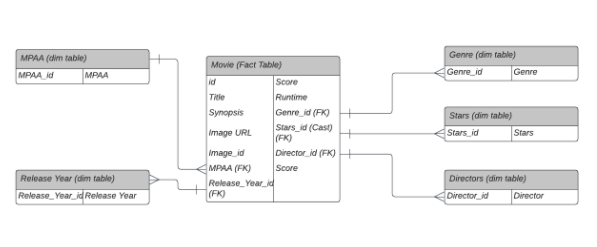
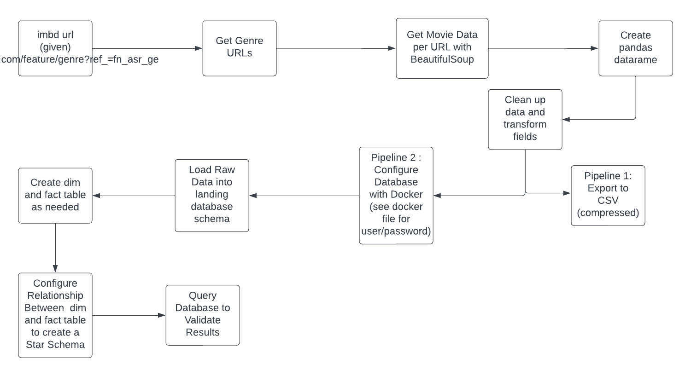
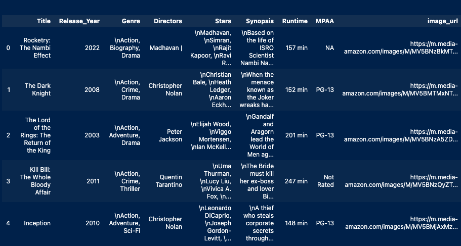
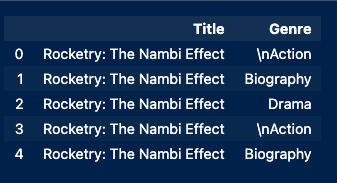

# NWO IMBD Case Study 
### Daniel Yassky

### To Run
```
docker-compose -f docker-compose.yaml up
python3 data_extract.py
python3 database.py
```
Note: Since data is committed to the database every run, might need to delete database before running python3 database.py again.

## Logs
See checks and validation of dataframe in the data_extract.py file
See checks and validation of basic database queries in the database.log file. 

## Packages (see requirements.txt for details)
beautifulsoup4<br>
pandas  <br>
psycopg2  <br>
requests  <br>


# Database Schematic

I chose a star schematic with dim tables having foreign keys to a centralized fact table. The fact table contains unique movie data   <b> per movie </b>. For example, the movie's title, the movie's image, etc. However, for things such as Release Year (where two movies can be released on the same year), there is a dimension table. See the schematic below. 



# System Architecture 

The architecture is based on two pipelines one that exports to a compressed csv and the other which adds the data to a postgres database configured with docker. 


# Data Frame Schema

Pre-normalized data saved in a CSV file from pandas data frame.



## Possible improvements and limitations

One possible improvement for larger projects would be to use more powerful scraping techniques such as frameworks like Scrapy or Seleneum. However, this does come at the cost of speed which is gained with a simple approach using bs4. 

Another possible limitation is the use of foreign keys when a n:m table would sometimes be better for certain data categories. At the moment, only a movie's full cast and/or genre category are queriable rather than individaul actors and/or genres. For example, Leonardo diCaprio may play in two movies with different casts. 

One possible imporvement would be to have many-to-many tables for genre and for movie stars. This could be set up with a joint table that mediates between movies and genres and movies and stars respectively with foreign keys to both. I began working on this, but did not have time to finish this more advanced implementation (see code below for how I started on this).




```
# Idea: Expand actors per movie and genres per movie rather than a whole cast/ full genre set expand and recreate facts table with this data using intermediary tables.

actors_moviedf = (movieDf.set_index(['Title', 'Runtime', 'Genre', 'Release_Year', 'Score', 'Directors', 'Synopsis', 'MPAA','image_url', 'image_id'])
   .apply(lambda x: x.str.split(',').explode())
   .reset_index()) 

genre_moviedf = (actors_moviedf.set_index(['Title', 'Runtime', 'Stars', 'Release_Year', 'Score', 'Directors', 'Synopsis', 'MPAA','image_url', 'image_id'])
   .apply(lambda x: x.str.split(',').explode())
   .reset_index()) 
   
# Tables for M-M relationship between movies to actors and movies to genres respectively 
actors_moviedf = actors_moviedf.drop(columns= ['Runtime', 'Release_Year', 'Score', 'Directors', 'Synopsis', 'MPAA','image_url', 'image_id', 'Genre'], axis=1)
genre_moviedf = genre_moviedf.drop(columns= ['Runtime', 'Stars', 'Release_Year', 'Score', 'Directors', 'Synopsis', 'MPAA','image_url', 'image_id'], axis=1)
```
Follow-up: Create intermediary database tables with foreign keys to both actors and movies/ genres to movies. 
